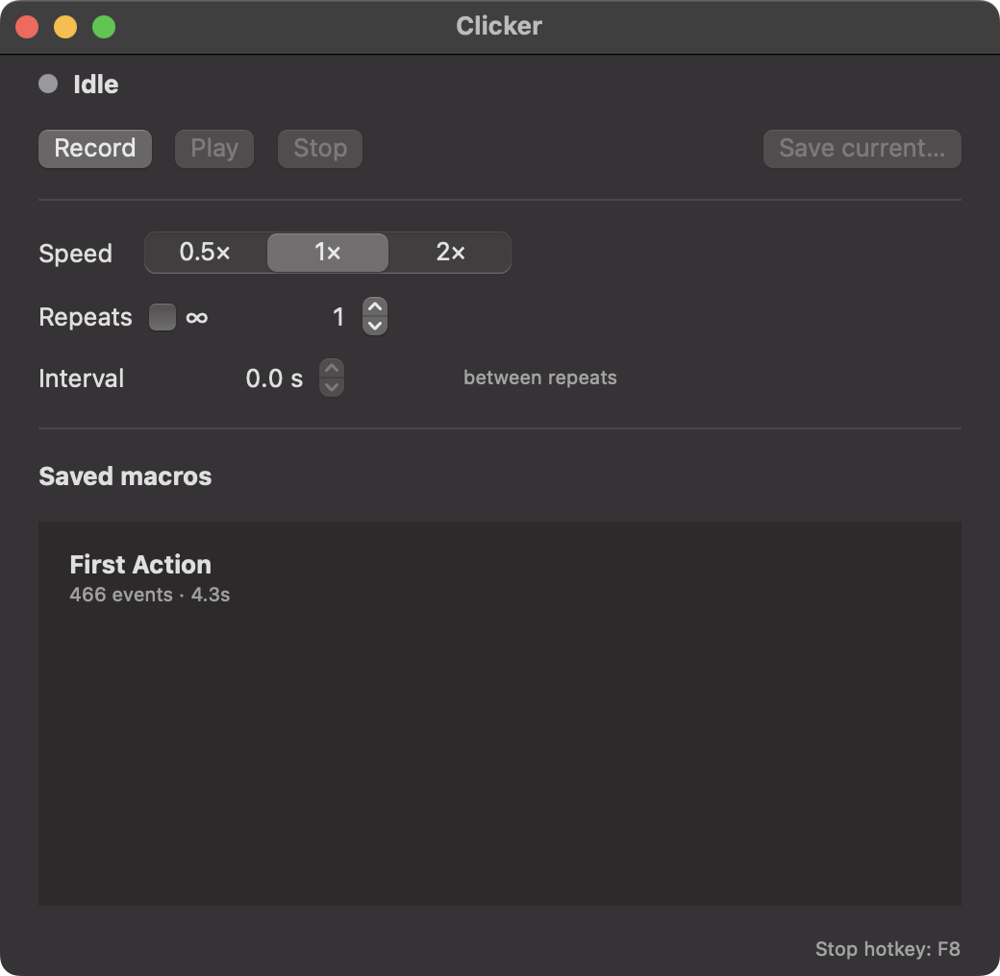
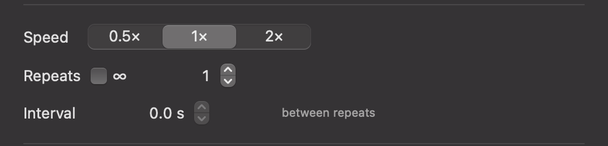
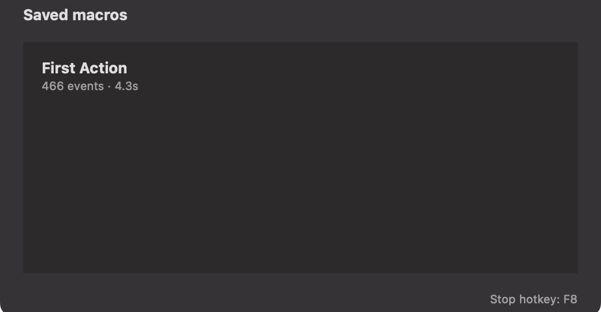
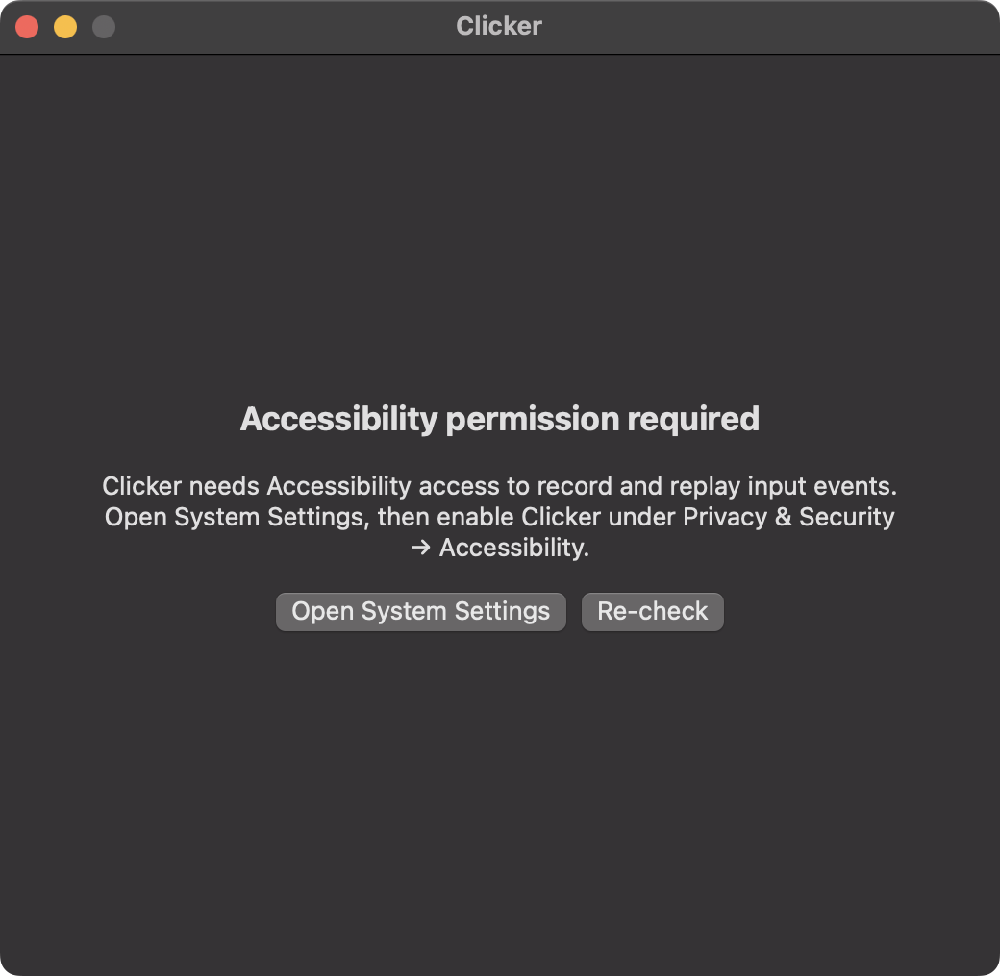

<div align="center">

# 🖱️ Clicker — Free Auto Clicker & Macro Recorder for macOS

**A blazing-fast, native macOS auto clicker and macro recorder built in SwiftUI.**
**Record mouse clicks, keystrokes and keyboard shortcuts — then replay them with adjustable speed, custom intervals and infinite loops.**

[](https://www.apple.com/macos/)
[](https://swift.org)
[](https://developer.apple.com/xcode/swiftui/)
[](LICENSE)
[](https://github.com/saermolaev/clicker/stargazers)

<p>
  <a href="#-download"><b>Download</b></a> ·
  <a href="#-features"><b>Features</b></a> ·
  <a href="#-screenshots"><b>Screenshots</b></a> ·
  <a href="#-quick-start"><b>Quick start</b></a> ·
  <a href="#-faq"><b>FAQ</b></a>
</p>


</div>

---

## ✨ Why Clicker?

**Clicker** is a tiny, free, open-source **auto clicker for macOS** and a fully-featured **macro recorder for Mac**. It captures real mouse and keyboard input from the system, then lets you replay it at any speed, any number of times, with any pause between repeats.

Designed for gamers, QA engineers, automation enthusiasts, accessibility users and anyone who is tired of doing the same click a thousand times.

- 🪶 **Tiny native app** — pure SwiftUI, no Electron, no background bloat
- 🎯 **Pixel-accurate playback** — uses Core Graphics event taps under the hood
- ⌨️ **Mouse + keyboard** — clicks, drags, scrolls, key presses, modifier combos
- 🔁 **Infinite loops** — repeat your macro forever, or N times
- 🚦 **Adjustable speed** — 0.5×, 1×, 2× playback
- ⏱️ **Custom interval** — seconds or minutes between repeats
- 💾 **Macro library** — save, name and reuse your macros
- 🛑 **Global stop hotkey (F8)** — stop playback from anywhere
- 🧪 **Fully unit-tested** — battle-tested EventPlayer with deterministic tests
- 🔓 **MIT licensed, no telemetry, no account, no ads**

---

## 📸 Screenshots

> The app runs as a regular macOS window. macOS 13 Ventura and newer are supported (Intel + Apple Silicon).

<div align="center">

### 🏠 Main window
*Record, play and manage your macros from one clean window.*



### 🎛️ Playback controls
*Pick speed, set repeats (or ∞), add a delay between iterations.*



### 📚 Macro library
*Every saved macro is one click away.*



### 🔐 Onboarding & Accessibility permission
*One-tap link to System Settings — the only permission Clicker needs.*



</div>

---

## ⬇️ Download

Grab the latest signed `.dmg` from the [Releases page](https://github.com/saermolaev/clicker/releases/latest) or build it yourself in 30 seconds (see [Build from source](#-build-from-source)).

```bash
# macOS 13 Ventura or newer · Intel & Apple Silicon
open Clicker-1.0.dmg
# drag Clicker.app into /Applications
```

> First launch: right-click → **Open** (the app is ad-hoc signed). Grant **Accessibility** permission when prompted — this is required by macOS for any tool that synthesises input.

---

## 🚀 Quick start

1. **Launch Clicker** and grant Accessibility access in System Settings.
2. Hit **Record**, perform your actions (clicks, drags, typing, shortcuts).
3. Press **Stop recording** when done.
4. Configure **Speed**, **Repeats** and **Interval**.
5. Hit **Play** — sit back and enjoy.
6. Hit **F8** anywhere on the system to stop playback instantly.
7. Click **Save current…** to add the macro to your library.

---

## 🧠 Features in detail

| Feature | What it does |
|---|---|
| 🎥 **Recording** | Captures global `mouseDown` / `mouseUp` / `mouseMoved` / `scrollWheel` / `keyDown` / `keyUp` / `flagsChanged` events with high-resolution timestamps |
| ▶️ **Playback** | Replays the exact event stream via `CGEvent.post` with original timing preserved |
| 🏃 **Speed control** | 0.5× (debug-friendly), 1× (real-time) or 2× (fast forward) |
| 🔁 **Repeats** | Run once, N times, or ∞ until you hit F8 |
| ⏸️ **Interval** | Pause 0–3600s (or 0–1440 min) between iterations |
| ⌨️ **Modifier-aware** | Correctly handles ⌘ ⌥ ⌃ ⇧ via dedicated `flagsChanged` synthesis |
| 💾 **Storage** | Macros saved as JSON in `~/Library/Application Support/Clicker/` |
| 🔑 **Global hotkey** | F8 is registered as a system-wide stop hotkey via Carbon `RegisterEventHotKey` |
| 🔒 **Permissions** | Only Accessibility — required by macOS for synthetic input |

---

## 🛠️ Build from source

Clicker uses [XcodeGen](https://github.com/yonaskolb/XcodeGen) so the project file stays out of git.

```bash
# 1. Install XcodeGen (once)
brew install xcodegen

# 2. Clone & generate
git clone https://github.com/saermolaev/clicker.git
cd clicker
xcodegen generate

# 3. Open & run
open Clicker.xcodeproj
# ⌘R in Xcode

# 4. (Optional) Build a distributable .dmg
./scripts/make_dmg.sh
```

### Run the tests

```bash
xcodebuild test -scheme Clicker -destination "platform=macOS"
```

---

## 🧱 Architecture

```
Clicker/
├── App/             # @main entry + AppState (ObservableObject)
├── Recording/       # EventRecorder — CGEventTap based capture
├── Playback/        # EventPlayer + CGEventPoster — async replay
├── Models/          # RecordedEvent, Macro, PlaybackRepeats
├── Storage/         # MacroStore — JSON persistence
├── Hotkeys/         # HotkeyManager — Carbon RegisterEventHotKey
├── Permissions/     # AccessibilityCheck
├── UI/              # SwiftUI views
└── Resources/       # Info.plist, assets
```

- **Pure SwiftUI** UI layer, **`@MainActor` AppState** as the single source of truth.
- **Structured concurrency** — playback runs in an async `Task` and cancels cleanly.
- **No external dependencies** — only the Apple SDK.

---

## ❓ FAQ

<details>
<summary><b>Is this a real auto clicker, or just a click recorder?</b></summary>

Both. Clicker can act as a **simple auto clicker** (record a single click + set ∞ repeats with an interval) and as a **full macro recorder** for complex sequences with keyboard, drags and scrolls.
</details>

<details>
<summary><b>Does it work on Apple Silicon (M1/M2/M3/M4)?</b></summary>

Yes — built as a universal binary, runs natively on Intel and Apple Silicon Macs.
</details>

<details>
<summary><b>Does it work in games?</b></summary>

In most games, yes. Clicker uses the same Core Graphics event posting that the OS itself uses. Some games with aggressive anti-cheat may detect or block synthetic input — use at your own risk and follow the rules of the game you play.
</details>

<details>
<summary><b>Why does it need Accessibility permission?</b></summary>

macOS requires this permission for any app that captures global input or synthesises events. Clicker does not read passwords or screen contents — only mouse and keyboard events while you are recording. Source code is open, you can verify it yourself.
</details>

<details>
<summary><b>Where are my macros stored?</b></summary>

`~/Library/Application Support/Clicker/` — one JSON file per macro. Safe to back up, sync via iCloud Drive, share with friends.
</details>

<details>
<summary><b>Can I change the stop hotkey from F8?</b></summary>

Not in the UI yet — it's hard-coded as F8. Configurable hotkeys are on the roadmap, PRs welcome.
</details>

---

## 🗺️ Roadmap

- [ ] Configurable global hotkeys
- [ ] Menu-bar mode (run without dock icon)
- [ ] Per-event editing of recorded macros
- [ ] Conditional triggers (image / pixel match)
- [ ] Export / import macros as `.clickermacro`
- [ ] iCloud sync between Macs

Have an idea? [Open an issue](https://github.com/saermolaev/clicker/issues/new).

---

## 🤝 Contributing

PRs and issues are very welcome! The codebase is small, modular and easy to navigate.

1. Fork the repo
2. `xcodegen generate`
3. Write a test for your change (see `ClickerTests/`)
4. Open a PR

---

## ⚠️ Disclaimer

Clicker is a general-purpose automation tool. **You are responsible** for how you use it. Do not use it to violate the Terms of Service of any application, game or website. Use it for accessibility, productivity, QA, testing — not for fraud, spam or cheating.

---

## 📄 License

[MIT](LICENSE) © Clicker contributors. Do whatever you want, just don't sue us.

---

<div align="center">

### ⭐ If Clicker saves you time, please star the repo — it really helps!

<a href="https://github.com/saermolaev/clicker">
  
</a>

<sub><b>Keywords:</b> macOS auto clicker · autoclicker for Mac · free auto clicker macOS · macro recorder Mac · click automation · mouse automation · keyboard macro · automation tool · SwiftUI app · open source autoclicker · M1 M2 M3 auto clicker · Apple Silicon · best free autoclicker mac · script recorder · UI automation · repeat clicks · auto typing mac</sub>

</div>
